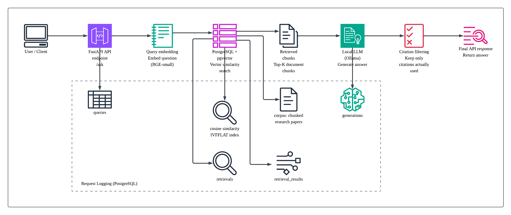
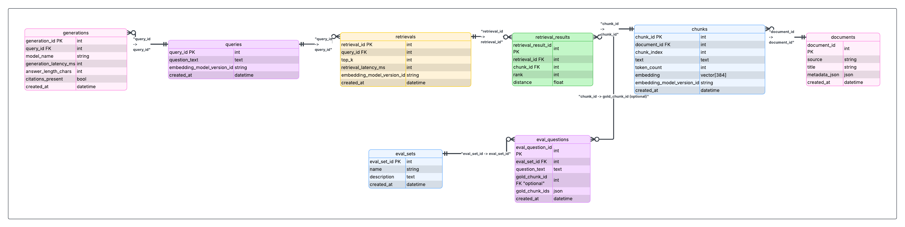

# Retrieval-Augmented Generation System

A containerized Retrieval-Augmented Generation (RAG) system for answering questions over research papers.

The system retrieves relevant document chunks using pgvector and generates answers using a local LLM served through Ollama.

Responses include citations pointing to the retrieved sources.

<br>

Key technologies:

- FastAPI
- PostgreSQL + pgvector
- Ollama (local LLM inference)
- Docker

<br>

## Example Query
<br>

```bash
curl -X POST http://localhost:8000/ask \
-H "Content-Type: application/json" \
-d '{"question":"What is agentic RAG?"}'
```

<br>

## Example Response
<br>

```JSON
{
  "answer": "Agentic RAG refers to a paradigm of retrieval-augmented generation systems that incorporate autonomous agents capable of dynamic decision-making and workflow optimization."
}
```

Optional debugging flags allow returning citations or retrieved chunks.

<br>

## Architecture

The system embeds incoming questions, retrieves relevant document chunks using pgvector, and generates answers with a local LLM.

Query and retrieval metadata are logged to support evaluation and debugging.

<br>

### System Flow


<br>

### Database Schema


<br>

## Retrieval Pipeline

Documents are chunked into overlapping segments and embedded using the **BGE-small** embedding model.

Embeddings are stored in **PostgreSQL with pgvector** and queried using cosine similarity.

Retrieval is configured with:

- IVFFLAT vector indexing
- configurable top-k retrieval
- chunk limits per document

This allows efficient semantic search over the document corpus while keeping the system simple and reproducible.

<br>

## Retrieval Evaluation

To measure retrieval quality, a small benchmark dataset was created.

```
Eval set: rag_core_v1
Questions: 27

Recall@5: 0.407
MRR: 0.355
```

Metrics include:

- **Recall@k** – whether the relevant chunk appears in the retrieved results
- **MRR (Mean Reciprocal Rank)** – how early the relevant result appears

This provides a basic signal of retrieval quality and allows experimentation with indexing parameters.

<br>

## Design Decisions

### PostgreSQL + pgvector
Chosen for simplicity and strong ecosystem support. pgvector enables vector search without introducing a separate vector database.

### Local LLM via Ollama
Running the model locally avoids external API dependencies and keeps the system fully reproducible.

### Retrieval logging
Queries, retrieval results, and generation metadata are stored to support evaluation and debugging.

<br>

## Challenges Encountered

Several practical issues emerged during development:

- retrieval frequently surfaced bibliography or reference sections
- embedding similarity does not always correlate with answer relevance
- citation filtering required parsing the model output
- containerizing LLM services introduced resource management challenges

These issues highlight common limitations in simple RAG pipelines.

<br>

## Limitations

Current limitations include:

- semantic retrieval can surface bibliography-style chunks
- evaluation dataset is small and tied to the current corpus snapshot
- no reranking stage is implemented

<br>

## Future Improvements

Possible improvements include:

- reranking model for improved retrieval quality
- query rewriting
- larger evaluation dataset
- streaming responses
- automated corpus ingestion

<br>

## Local Setup

Start the stack:

```bash
docker compose up --build
```

Pull the model:

```bash
docker exec -it rag-ollama ollama pull llama3.2
```

Ingest documents:

```bash
docker exec -it rag-api python -m app.scripts.ingest_one
```

Run the API:
```bash
curl -X POST localhost:8000/ask \
-H "Content-Type: application/json" \
-d '{"question":"What is agentic RAG?"}'
```